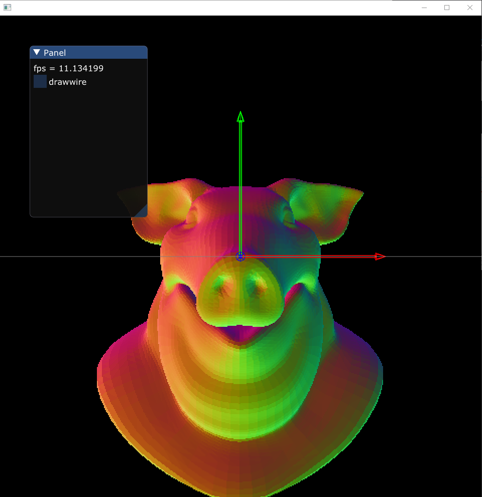

## build
premake5 vs2019

## hello world

```
        for (pxr::UsdPrim p : pStage->Traverse())
        {
            if (p.IsA<pxr::UsdGeomMesh>())
            {
                pxr::UsdGeomMesh mesh(p);
                pxr::UsdAttribute pointAttrib = mesh.GetPointsAttr();
                pxr::VtArray<pxr::GfVec3f> points;
                pointAttrib.Get(&points);
                pxr::GfMatrix4f matrix = pxr::GfMatrix4f(mesh.ComputeLocalToWorldTransform(pxr::UsdTimeCode::Default()));
                glm::mat4 m;
                memcpy(glm::value_ptr(m), matrix.data(), sizeof(glm::mat4));
                pr::SetObjectTransform(m);
                for (int i = 0; i < points.size(); ++i)
                {
                    pxr::GfVec3f point = points[i];
                    DrawPoint({ point[0], point[1], point[2] }, { 255, 255, 255 }, 2);
                }
                pr::SetObjectIdentify();
            }
        }
        
```

## versions
tbb2017_20170412oss, USD-21.05, boost_1_76_0-msvc-14.2-64, cmake 3.17.1

## Release build
super mini config

Release:

```
"C:\Program Files\CMake\bin\cmake.exe" -G "Visual Studio 16 2019" -DPXR_BUILD_TESTS=FALSE -DPXR_BUILD_EXAMPLES=FALSE -DPXR_BUILD_TUTORIALS=FALSE -DPXR_BUILD_USD_TOOLS=FALSE -DPXR_BUILD_IMAGING=FALSE -DPXR_BUILD_USD_IMAGING=FALSE -DPXR_BUILD_USDVIEW=FALSE -DPXR_ENABLE_PYTHON_SUPPORT=FALSE -DPXR_ENABLE_HDF5_SUPPORT=FALSE -DPXR_ENABLE_PTEX_SUPPORT=FALSE -DPXR_ENABLE_GL_SUPPORT=FALSE -DTBB_ROOT_DIR=C:\workspace\USD-21.05\tbb2017_20170412oss -DBOOST_ROOT=C:/local/boost_1_76_0 -DCMAKE_INSTALL_PREFIX=C:\workspace\USD-21.05\USD-21.05\build\installed C:\workspace\USD-21.05\USD-21.05

cmake --build . --config RelWithDebInfo --target install -- /m:%NUMBER_OF_PROCESSORS% 

```

Debug:

```
"C:\Program Files\CMake\bin\cmake.exe" -G "Visual Studio 16 2019" -DPXR_BUILD_TESTS=FALSE -DPXR_BUILD_EXAMPLES=FALSE -DPXR_BUILD_TUTORIALS=FALSE -DPXR_BUILD_USD_TOOLS=FALSE -DPXR_BUILD_IMAGING=FALSE -DPXR_BUILD_USD_IMAGING=FALSE -DPXR_BUILD_USDVIEW=FALSE -DPXR_ENABLE_PYTHON_SUPPORT=FALSE -DPXR_ENABLE_HDF5_SUPPORT=FALSE -DPXR_ENABLE_PTEX_SUPPORT=FALSE -DPXR_ENABLE_GL_SUPPORT=FALSE -DTBB_ROOT_DIR=C:\workspace\USD-21.05\tbb2017_20170412oss -DBOOST_ROOT=C:/local/boost_1_76_0 -DCMAKE_INSTALL_PREFIX=C:\workspace\USD-21.05\USD-21.05\build\installed_debug C:\workspace\USD-21.05\USD-21.05

cmake --build . --config Debug --target install -- /m:%NUMBER_OF_PROCESSORS% 

```

note: VS project want's __TBB_NO_IMPLICIT_LINKAGE on debug build
